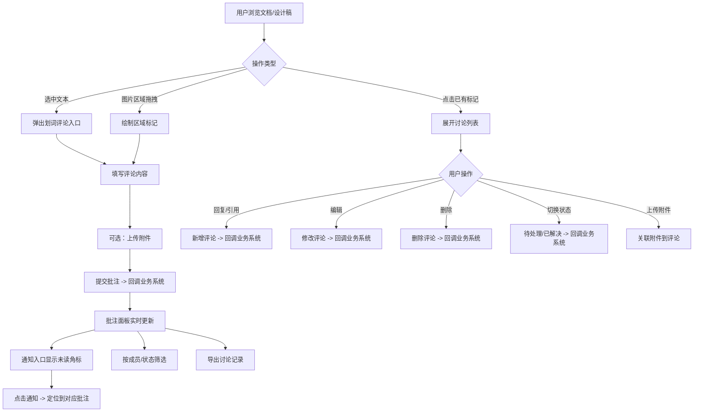

## 1. 产品概述

在线协作批注组件库（AnnotationKit）是一套可嵌入文档预览、设计稿评审和课程学习平台的通用批注组件。组件库对外暴露五类能力——批注面板、划词评论、区域标记、讨论列表和通知入口，支持文本/图片定点评论、回复引用、状态流转、筛选定位、附件上传与讨论记录导出。组件通过 props 接收外部用户信息和权限配置，并通过回调将新增、解决、删除等操作委托给业务系统处理。

- **目标用户**：文档协作团队、设计师与评审者、在线教育平台师生
- **核心价值**：降低多场景批注能力的接入成本，提供一致的协作体验

## 2. 核心功能

### 2.1 用户角色

| 角色 | 权限说明 |
|------|----------|
| 普通成员 | 发起批注、回复、引用、编辑/删除自己的评论、上传附件、标记状态 |
| 管理员 | 拥有普通成员全部权限，同时可删除他人评论、管理所有批注状态 |

### 2.2 功能模块

1. **批注面板（AnnotationPanel）**：以侧边栏或浮层形式集中展示当前文档/设计稿的所有批注，支持筛选、排序、定位
2. **划词评论（TextSelectionComment）**：在文本内容中选中文字后弹出评论入口，锚定到选中范围
3. **区域标记（AreaMarker）**：在图片或设计稿上拖拽绘制矩形标记区域，关联批注讨论
4. **讨论列表（DiscussionList）**：以线程形式展示单个批注下的评论、回复和引用关系
5. **通知入口（NotificationEntry）**：以铃铛图标 + 未读角标展示未读批注汇总，点击展开通知列表

### 2.3 页面详情

| 组件名称 | 子模块 | 功能描述 |
|----------|--------|----------|
| 批注面板 | 筛选栏 | 按成员、状态（待处理/已解决）筛选批注列表 |
| 批注面板 | 批注列表 | 展示当前文档所有批注摘要，点击定位到原文/原图位置 |
| 批注面板 | 导出按钮 | 一键导出全部讨论记录为 JSON/CSV 文件 |
| 划词评论 | 选中浮窗 | 文本选中后弹出"添加批注"按钮，确认后锚定选区 |
| 划词评论 | 高亮标记 | 已批注的文本区域以高亮背景展示，未读批注使用不同颜色 |
| 区域标记 | 绘制工具 | 在图片/设计稿上拖拽绘制矩形，关联批注入口 |
| 区域标记 | 标记展示 | 已标记区域显示编号角标，点击展开对应讨论 |
| 讨论列表 | 评论线程 | 展示主评论及所有回复，支持引用嵌套 |
| 讨论列表 | 评论操作 | 编辑、删除（仅自己的评论）、回复、引用 |
| 讨论列表 | 状态切换 | 将批注标记为"待处理"或"已解决" |
| 讨论列表 | 附件上传 | 在评论中上传小附件（图片/文件） |
| 通知入口 | 通知列表 | 展示最近的未读批注通知，点击跳转到对应位置 |

## 3. 核心流程

## 4. 用户界面设计

### 4.1 设计风格

- **主色调**：以中性色（Slate/Gray）为基底，品牌蓝（#2563EB）作为交互强调色
- **辅色**：未读/待处理使用琥珀色（#F59E0B），已解决使用翠绿色（#10B981）
- **字体**：系统默认无衬线字体栈（-apple-system, Segoe UI, sans-serif），标题 14px/600，正文 13px/400，辅助文字 12px/400
- **圆角与阴影**：卡片圆角 8px，按钮圆角 6px，浮层使用 `0 4px 24px rgba(0,0,0,0.12)` 阴影
- **布局风格**：批注面板采用右侧固定侧边栏（320px 宽），内容区域自适应；标记区域使用绝对定位覆盖在目标内容之上
- **图标**：使用 lucide-react 图标库

### 4.2 页面设计概览

| 组件名称 | 模块 | UI 元素 |
|----------|------|---------|
| 批注面板 | 面板容器 | 320px 宽，右侧固定，白色背景，顶部筛选栏 + 中间列表 + 底部导出按钮 |
| 批注面板 | 筛选栏 | 水平排列：状态下拉（全部/待处理/已解决）+ 成员下拉多选 + 搜索框 |
| 批注面板 | 批注列表项 | 左侧状态色条 + 头像 + 用户名 + 文本预览(2行截断) + 时间戳 + 未读蓝点 |
| 划词评论 | 选中浮窗 | 紧贴选区的小型弹出按钮，圆角 6px，蓝色背景白色图标 |
| 划词评论 | 文本高亮 | 已读批注：淡黄底色 (#FEF3C7)；未读批注：淡蓝底色 (#DBEAFE) + 左侧蓝色竖线 |
| 区域标记 | 标记框 | 蓝色虚线边框矩形，左上角显示编号角标（圆形蓝色底白色数字） |
| 讨论列表 | 线程容器 | 最大高度 400px 内滚动，评论项左侧灰色竖线连接，支持嵌套引用 |
| 讨论列表 | 评论卡片 | 头像 + 用户名 + 时间 + 内容正文 + 附件缩略图 + 操作按钮行（回复/引用/编辑/删除） |
| 讨论列表 | 状态标签 | 待处理：琥珀色圆角标签；已解决：绿色圆角标签，点击切换 |
| 通知入口 | 铃铛图标 | 右上角固定定位，带红色未读数字角标，点击展开下拉通知面板 |
| 通知入口 | 通知面板 | 320px 宽下拉面板，通知项：头像 + 描述文字 + 时间 + 点击跳转 |

### 4.3 响应式设计

- 桌面端优先设计（≥1024px）
- 批注面板在平板（768-1023px）缩小为 280px
- 移动端（<768px）：批注面板变为底部抽屉（Sheet），区域标记缩放适配

## 5. 组件对外接口设计

### 5.1 Props 输入

| 属性 | 类型 | 必填 | 说明 |
|------|------|------|------|
| currentUser | User | 是 | 当前登录用户信息（id, name, avatar） |
| users | User[] | 否 | 可筛选的成员列表 |
| permissions | Permission | 否 | 当前用户权限配置 |
| annotations | Annotation[] | 否 | 外部传入的批注数据（受控模式） |
| targetType | 'document' \| 'design' \| 'course' | 是 | 标注目标类型 |
| targetId | string | 是 | 标注目标唯一标识 |
| theme | 'light' \| 'dark' | 否 | 主题模式，默认 light |

### 5.2 回调事件

| 回调 | 参数 | 说明 |
|------|------|------|
| onAnnotationCreate | (annotation: Annotation) => void | 新增批注时触发 |
| onAnnotationUpdate | (annotation: Annotation) => void | 编辑批注时触发 |
| onAnnotationDelete | (annotationId: string) => void | 删除批注时触发 |
| onAnnotationResolve | (annotationId: string) => void | 标记已解决时触发 |
| onAnnotationReopen | (annotationId: string) => void | 重新打开（标记待处理）时触发 |
| onCommentAdd | (annotationId: string, comment: Comment) => void | 新增回复时触发 |
| onCommentUpdate | (comment: Comment) => void | 编辑回复时触发 |
| onCommentDelete | (commentId: string) => void | 删除回复时触发 |
| onAttachmentUpload | (file: File) => Promise<string> | 附件上传，返回 URL |