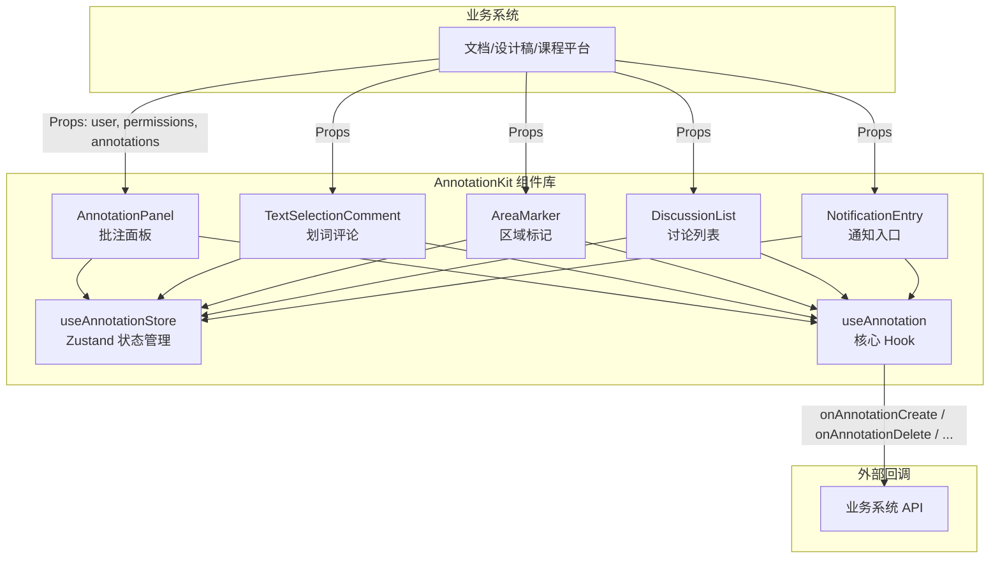
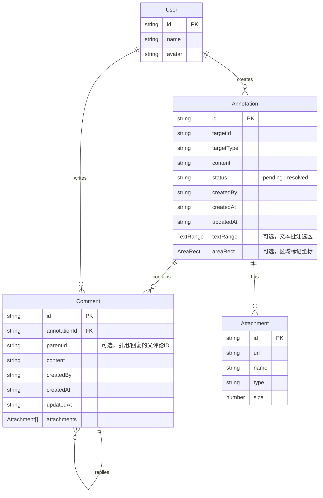

## 1. 架构设计



## 2. 技术选型

- **前端框架**：React@18 + TypeScript
- **构建工具**：Vite
- **样式方案**：Tailwind CSS@3
- **状态管理**：Zustand
- **图标库**：lucide-react
- **路由**：react-router-dom（仅用于 Demo 演示页面）
- **测试**：Vitest + @testing-library/react
- **后端**：无（纯前端组件库，通过回调对接业务系统）
- **数据**：组件内部维护本地状态，支持受控模式（外部传入 annotations）

## 3. 目录结构

```
src/
├── components/                  # 可复用组件
│   ├── AnnotationPanel/         # 批注面板
│   │   ├── AnnotationPanel.tsx
│   │   ├── FilterBar.tsx
│   │   ├── AnnotationListItem.tsx
│   │   └── ExportButton.tsx
│   ├── TextSelectionComment/    # 划词评论
│   │   ├── TextSelectionComment.tsx
│   │   ├── SelectionPopover.tsx
│   │   └── HighlightLayer.tsx
│   ├── AreaMarker/              # 区域标记
│   │   ├── AreaMarker.tsx
│   │   ├── MarkerRect.tsx
│   │   └── DrawingLayer.tsx
│   ├── DiscussionList/          # 讨论列表
│   │   ├── DiscussionList.tsx
│   │   ├── CommentCard.tsx
│   │   ├── CommentInput.tsx
│   │   ├── StatusBadge.tsx
│   │   └── AttachmentUploader.tsx
│   ├── NotificationEntry/       # 通知入口
│   │   ├── NotificationEntry.tsx
│   │   └── NotificationPanel.tsx
│   └── ui/                      # 基础 UI 组件
│       ├── Avatar.tsx
│       ├── Badge.tsx
│       ├── Button.tsx
│       ├── Dropdown.tsx
│       ├── Modal.tsx
│       └── Tooltip.tsx
├── hooks/                       # 自定义 Hooks
│   ├── useAnnotation.ts         # 批注核心 Hook
│   ├── useTextSelection.ts      # 文本选择 Hook
│   └── useAreaDrawing.ts        # 区域绘制 Hook
├── store/                       # Zustand 状态管理
│   └── annotationStore.ts
├── types/                       # TypeScript 类型定义
│   └── index.ts
├── utils/                       # 工具函数
│   ├── export.ts                # 导出功能
│   └── position.ts              # 位置计算
├── pages/                       # Demo 演示页面
│   ├── DocumentDemo.tsx
│   ├── DesignDemo.tsx
│   └── HomePage.tsx
├── App.tsx
├── main.tsx
└── index.css
```

## 4. 路由定义

| 路由 | 页面 | 说明 |
|------|------|------|
| / | HomePage | 首页，展示三种场景入口 |
| /demo/document | DocumentDemo | 文档批注演示 |
| /demo/design | DesignDemo | 设计稿批注演示 |
| /demo/course | DocumentDemo | 课程平台批注演示（复用文档场景） |

## 5. 数据模型

### 5.1 实体定义



### 5.2 TypeScript 类型定义

```typescript
interface User {
  id: string;
  name: string;
  avatar: string;
}

interface TextRange {
  startOffset: number;
  endOffset: number;
  text: string;
  containerSelector: string;
}

interface AreaRect {
  x: number;
  y: number;
  width: number;
  height: number;
  relativeTo: 'image' | 'viewport';
}

interface Attachment {
  id: string;
  url: string;
  name: string;
  type: string;
  size: number;
}

type AnnotationStatus = 'pending' | 'resolved';

interface Annotation {
  id: string;
  targetId: string;
  targetType: 'document' | 'design' | 'course';
  content: string;
  status: AnnotationStatus;
  createdBy: string;
  createdAt: string;
  updatedAt: string;
  textRange?: TextRange;
  areaRect?: AreaRect;
  comments: Comment[];
  attachments: Attachment[];
}

interface Comment {
  id: string;
  annotationId: string;
  parentId?: string;
  content: string;
  createdBy: string;
  createdAt: string;
  updatedAt: string;
  attachments: Attachment[];
}

interface Permission {
  canCreate: boolean;
  canEdit: boolean;
  canDelete: boolean;
  canResolve: boolean;
  canUpload: boolean;
  canExport: boolean;
  isAdmin: boolean;
}

interface AnnotationKitProps {
  currentUser: User;
  users?: User[];
  permissions?: Permission;
  annotations?: Annotation[];
  targetType: 'document' | 'design' | 'course';
  targetId: string;
  theme?: 'light' | 'dark';
  onAnnotationCreate?: (annotation: Annotation) => void;
  onAnnotationUpdate?: (annotation: Annotation) => void;
  onAnnotationDelete?: (annotationId: string) => void;
  onAnnotationResolve?: (annotationId: string) => void;
  onAnnotationReopen?: (annotationId: string) => void;
  onCommentAdd?: (annotationId: string, comment: Comment) => void;
  onCommentUpdate?: (comment: Comment) => void;
  onCommentDelete?: (commentId: string) => void;
  onAttachmentUpload?: (file: File) => Promise<string>;
}
```

## 6. 核心 Hook 设计

### useAnnotation Hook

组件库的核心 Hook，统一管理批注的生命周期操作，所有组件通过此 Hook 与状态层交互。

```typescript
function useAnnotation(props: AnnotationKitProps) {
  return {
    // 状态
    annotations: Annotation[];
    filteredAnnotations: Annotation[];
    unreadCount: number;
    notifications: Notification[];
    
    // 操作方法
    createAnnotation: (data: CreateAnnotationData) => void;
    updateAnnotation: (id: string, data: Partial<Annotation>) => void;
    deleteAnnotation: (id: string) => void;
    resolveAnnotation: (id: string) => void;
    reopenAnnotation: (id: string) => void;
    addComment: (annotationId: string, data: CreateCommentData) => void;
    updateComment: (commentId: string, content: string) => void;
    deleteComment: (commentId: string) => void;
    
    // 筛选
    filterByStatus: (status: AnnotationStatus | 'all') => void;
    filterByMember: (userIds: string[]) => void;
    searchAnnotations: (keyword: string) => void;
    
    // 定位
    locateAnnotation: (id: string) => void;
    
    // 标记已读
    markAsRead: (id: string) => void;
    markAllAsRead: () => void;
    
    // 导出
    exportDiscussions: (format: 'json' | 'csv') => void;
    
    // 附件
    uploadAttachment: (annotationId: string, file: File) => Promise<void>;
    removeAttachment: (annotationId: string, attachmentId: string) => void;
  };
}
```

## 7. Zustand Store 设计

```typescript
interface AnnotationState {
  annotations: Annotation[];
  unreadIds: Set<string>;
  filterStatus: AnnotationStatus | 'all';
  filterUserIds: string[];
  searchKeyword: string;
  
  // Actions
  setAnnotations: (annotations: Annotation[]) => void;
  addAnnotation: (annotation: Annotation) => void;
  updateAnnotation: (id: string, data: Partial<Annotation>) => void;
  removeAnnotation: (id: string) => void;
  addComment: (annotationId: string, comment: Comment) => void;
  updateComment: (commentId: string, content: string) => void;
  removeComment: (commentId: string) => void;
  setFilterStatus: (status: AnnotationStatus | 'all') => void;
  setFilterUserIds: (userIds: string[]) => void;
  setSearchKeyword: (keyword: string) => void;
  addUnreadId: (id: string) => void;
  removeUnreadId: (id: string) => void;
  clearUnreadIds: () => void;
}
```